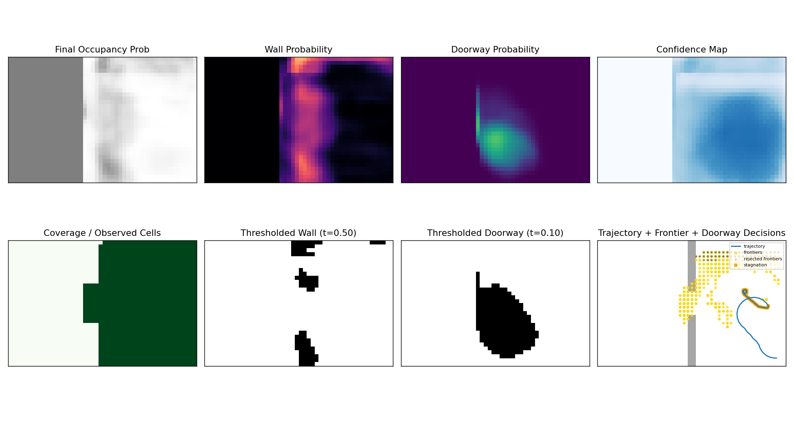
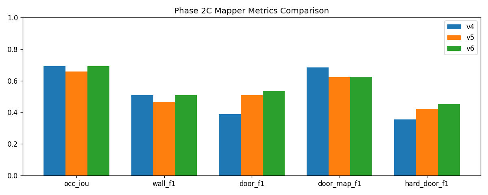
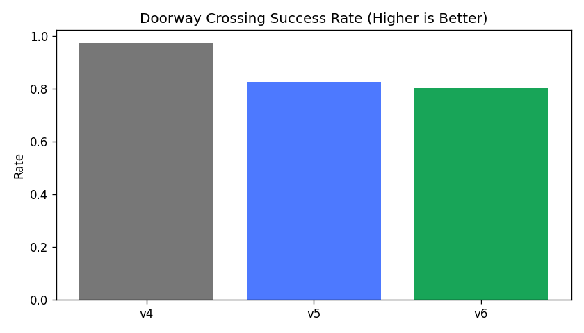

# Acoustic Drone Navigation and Mapping

This project builds a bat-inspired ultrasonic perception stack for mapping and safe navigation.

## Results

| Model | Success | Collisions | Fake doorway approaches | Doorway crossing | Coverage | Timeout |
|---|---:|---:|---:|---:|---:|---:|
| Mapper-guided navigation v3 | 78.17% | 0.00% | 0.00% | 92.83% | 66.08% | 6.17% |

## What this demonstrates

- Acoustic/ultrasonic sensing simulation
- Echo feature extraction
- Occupancy and doorway mapping
- Neural echo interpretation
- Mapper-guided navigation
- Safety-aware evaluation
- Lightweight visual simulation demos

## Demo figures







## Pipeline

```
Synthetic room map
    ↓
Acoustic echo simulation
    ↓
Signal processing / neural mapper
    ↓
Occupancy + doorway confidence map
    ↓
Mapper-guided navigation policy
    ↓
Evaluation: success, collisions, coverage, timeout
```

## Current accepted components

- Accepted mapper:
  - `runs/accepted_models/phase2c5_hybrid_acoustic_mapper/manifest.json`
- Accepted mapper-guided navigation:
  - `runs/accepted_models/phase2d_mapper_guided_navigation_v3/manifest.json`

## Repository layout

- `signal_processing/`: dataset generation, matched-filter baselines, acoustic feature extraction
- `neural_network/`: supervised CNNs/regressors, hybrid evaluators, confidence/safety logic
- `simulation/phase2_mapping/`: Phase 2 mapping pipeline (baseline mapper, dataset generator, neural mapper, readiness eval)
- `sim_env/`: clean visual simulation sandbox for reusable demos
- `runs/`: experiment outputs, accepted-model manifests, publish figures
- `datasets/`: generated synthetic datasets
- `docs/`: project documentation

## Source code vs generated outputs

- Source code:
  - `signal_processing/`, `neural_network/`, `simulation/`, `sim_env/`, `tests/`
- Generated experiment outputs:
  - `runs/` (metrics, plots, accepted manifests)
- Generated datasets:
  - `datasets/`

See:
- `docs/repository_structure.md`
- `datasets/README.md`

## Quick demos (`sim_env`)

```bash
python sim_env/examples/run_basic_world.py --map doorway --difficulty clean --steps 100 --save-plots
python sim_env/examples/run_mapper_demo.py --map doorway --difficulty clean --steps 100 --save-plots
python sim_env/examples/run_navigation_demo.py --map doorway --difficulty clean --steps 150 --save-plots
```

Outputs are saved under `sim_env/outputs/`.

## Dependencies

- Lightweight demos: `requirements-light.txt`
- Training/evaluation stack: `requirements-training.txt`
- Full setup: `requirements.txt`

## Notes

- `simulation/phase2_mapping/` remains the primary training/evaluation pipeline.
- `sim_env/` is intentionally lightweight (`numpy`, `matplotlib`) and is not an RL training loop.
